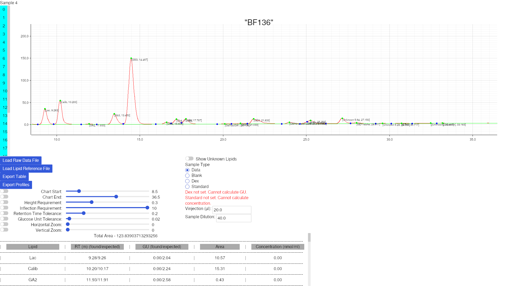

HPLC-RS is an app to automate analyzing data obtained from HPLC samples.

* [Overview](#overview)
* [Documentation](#documenatation)
* [System Requirements](#system-requirements)
* [Installation](#installation)
* [Compilation](#compilation)
* [Examples](#examples)
* [Methods](#methods)

# Overview

It supports generating a baseline, identifing peaks/inflections and labelling peaks as certain lipids.
It can be configured to adjust for the noise expected from the HPLC results.
It can export results to both CSVs and SVGs.

# Documentation

HPLC-RS depends on raw `arw` files provided by the `Empower` app and reference files provided by the researcher.

## Input Data

The structure of the `arw` is simple and not determined by the researcher but it is worth outlining anyway.

The file begins with several headers, most are ignored but the line with `"SampleName"` will be used as a key to provide the title for each sample.
All other headers are ignored.
```
"SampleName"	"BF111"
"System Name"	"Alliance 2"
"Sample Set Name"	"DTtV_KW_07012022_GSL_NewHPLC"
"Date Acquired"	"1/7/2022 3:22:48 PM GMT"
"Sample Set Start Date"	"1/7/2022 2:44:26 PM GMT"
```

Afterwards is a set of numbers separated by `\t` (tabs).
The number on the left is the time in minutes and forms the x-value.
The number on the right is the height of the data point and forms the y-value.
```
0	0.001693726
0.01666667	0.006185913
0.03333333	-0.0002410889
0.05	-0.002096558
0.06666667	-0.003659058
0.08333333	0.0008331299
0.1	0.01489563
0.1166667	0.02827454
0.1333333	0.0323761
0.15	0.02827454
```

> [!NOTE]
> Empower will export its "raw" data using files with an `arw` extension (an image format).
> This extension is inaccurate as they are simply plain text files which should be opened with a text editor or spreadsheet app.

The reference file format is supplied by the researcher and its format is therefore more important.

It is a `csv` (or optionally `tsv`, both are supported)
Each *column* represents some value, the headers are *required* (to allow each column to be position independent)
Supported keys are `Name`, `RT` (Retention Time) and `GU` (Glucose Units)
The order in which the columns are placed does not matter and neither does the order in which rows are placed.

```
Name,GU,RT
Lac,2.03,9.23
Calib,2.24,10.155
GA2,2.59,11.926
Lc3,2.71,12.617
Gb3,2.84,13.391
GM3,3,14.39
GM2,3.34,16.538
Gb4,3.43,17.119
pGb,3.53,17.694
GA1,3.6,18.5
GalNacGA1,3.96,20.067
Unknown 4.06,4.06,20.566
GM1a,4.14,20.965
GD3,4.31,21.759
alpha-23SpG,4.39,22.12
Unknown 4.49,4.55,22.802
GM1b or alpha-26SpG,4.82,23.926
part of GM1b 4.88,4.89,24.217
Unknown 4.99,4.51,22.642
GD1a,5.11,25.067
Leb,5.13,25.174
Unknown 5.64,5.64,27.084
GD1b,5.8,27.7
GD1-alpha,5.86,27.933
Unknown 6.15,6.15,29.027
Unknown 6.28,6.28,29.52
GT1b,6.57,30.647
```

Name will be used to label peaks, if the RT or GU match.
RT and GU represent the *expected* time at which a lipid will appear, if there exists a peak which is "close enough" to a known lipid in terms of RT/GU it will be assigned a lipid reference.

> [!WARNING]
> Microsoft Office products are likely to insert an invisible character called a BOM (byte order mark) into their csvs upon export
> If this character is inserted, it will *invalidate* the first column (as BOM + Name is not the same as just Name)
> To solve this either use a text editor which is capable of removing this character or fill the first column with invalid data
> ```
> Index,Name,GU
> 0,Lac,2.03
> 1,Calib,2.24
> 2,GA2,2.58
> 3,Lc3,2.71
> 4,Gb3,2.84
> 5,GM3,3
> 6,GM2,3.34
> 7,Gb4,3.44
> 8,pGb,3.53
> 9,GA1,0
> 10,GalNacGA1,3.96
> 11,Unknown 4.06,4.06
> 12,GM1a,4.15
> 13,GD3,4.32
> 14,alpha-23SpG,4.41
> 15,Unknown 4.49,4.49
> 16,GM1b or alpha-26SpG,4.84
> 17,part of GM1b 4.88,0
> 18,Unknown 4.99,0
> 19,GD1a,5.1
> 20,Leb,5.16
> 21,Unknown 5.64,5.69
> 22,GD1b,5.83
> 23,GD1-alpha,5.89
> 24,Unknown 6.15,0
> 25,Unknown 6.28,6.3
> 26,GT1b,6.61
> ```
> `Index` is an invalid key regardless of whether or not the BOM is present but protects the valid `Name` column from being invalidated by the BOM

## App UI


### Loading Data
Several buttons are provided for loading data
`Load Raw Data File` will present a dialog for loading the aformentioned `arw` files (the selector should support multiple selection as does the app)
`Load Lipid Reference File` will present a dialog for loading the aformentioned reference file (only one file can be loaded at a time)

Expected file extensions are `.arw`, `.csv`, `.tsv` and `.txt` though any file with the correct format will be loaded correctly regardless of extension.

### Configuring Analysis
HPLC-RS provides easy runtime configuration rather than depending on external files or hardcoded values

`Chart Start` and `Chart End` elements are used to determine the range of data that will be considered.
These values affect the baseline, total area and peaks found.

`Height Requirement` determines how far above the baseline a peak must lie to be determined a "real" peak rather than simply noise.
`Inflection Requirement` is similar but based on the 2nd derivate, it's purpose will be explained in the [Methods](#methods) section.

RT Tolerance and GU tolerance serve the same purpose but operate on different values.
Real lipids may not always appear at precisely the time they are expected to appear, these sliders determine how much uncertainty is allowed to label a peak.
e.g. If the reference says that Lac will appear at RT 9.26 and there exists a peak at RT 9.28, the peak may be Lac. If (9.28 - 9.26) < RT Tolerance, then the 9.28 peak will be labelled "Lac".

Horizontal/Vertical Zoom serve only to simplify viewing the graph and do not affect it's internal analysis.

If the default ranges/steps of these sliders do not serve the needs of the researches an "advanced" configuration toggle.


The first input field allows for setting the value directly, this is unbounded and may exceed the range of the slider.
The following 2 fields allow setting the range of the slider, this may allow for finer or more coarse values, as determined by the researcher.
The final field (step) determines by how much the slider should increase at every interval. Larger setps are more course, smaller steps are finer.

The horizontal/vertical sliders are special in that they operate exponentially.
They operate based on 2 values "x" (which is determined by the slider position) and "base" (which is a variable).
Zoom is calculated by computing `base ^ x`.

The first field allows for setting zoom directly (ie not `x`)
The second and third fields allow for controlling the range of `x` (ie not the actual range of zoom)
The fourth field allows for changing the `base` of the exponential. Larger bases will zoom in faster than smaller bases


### Sample Types
The radio button allows selecting one of 4 sample types: `data`, `blank`, `dex` and `standard`
Samples are assumed to be plain data by default and treated as such.

If a sample is marked as being the `standard` for the sample set its primary peak will be used to calculate the concentration of all other peaks in every sample.
The Vinjection and dilution parameters can be edited directly to ensure concentration is always accurate.

If a sample is marked as `dex` it will be used to calculate the GU based on RT using cubic spline interpolation.
Each primary peak will be assigned an index (starting at 2) and increasing by 1 each peak. More peaks are shown than are actually used to calculate dex.
Unfortunately, `Empower` seems to use a slightly different implementation of cubic splines than we do leading to a discrepancy in expected and calculated GU values.
Becuase of this discrepancy and because we are not aware of where the different lies we recommend not setting `dex` and relying on RT only.

`blank` is currently unused and does nothing.

### Visualising Data

There are 2 main UI blocks where data is presented, the graph and the table

#### Graph

On the graph, the green line represents the `baseline` of the graph, from which heights and areas is calculated.
The red line is simply the data provided by the `arw` files.

Plotted on it are **blue** and **green** dots. The **blue** dots represent mimina found in the data while **green** points represent retention points in the data.
The **green** dots will be labelled with the lipid they are assossiated with (if known) and their retention time.
The font size may be a bit small and is unfortunately not currently configurable at runtime.

#### Table

The table provides data in a more orderly fashion.
Each row represents one entry in the provided lipid reference file.
If the lipid has been identified in the data then the RT at which it has been found and its area will be included.
For GU and Concentration to be present the lipid must have been found and a `Dex` or `Standard` needs to have been set

### Exporting Data

The `Export Table` button will export a `csv` file containing as much data as could be gathered from the analysis.
There is little configuration availible for how this is implemented but can be opened with any spreadsheet software.

The `Export Profiles` button will export one `svg` file per sample into a *folder* of the researcher's choice. HPLC-RS will not create any new folders so ensure you have made a dedicated `export` folder or similar.

# System Requirements

HPLC-RS supports Linux, Windows and MacOS.

Most actions are effectively instant on modern hardware, including importing and exporing files.

Development is performed on a desktop Linux (NixOS 25.11) system and is therefore the most tested.
The app has also been tested on an Apple Silicon MacOS (Version Unknown)
It has not been tested on Windows.

Pre-built binaries are offered for the following systems
* x86_64-linux
* x86_64-windows
* aarch64-darwin (Apple Silicon)
* x86_64-darwin (Apple Intel)

More details in [Installation](#installation)
Other systems may need to compile from source according to [Compilation](#compilation)

## Linux

It is highly unlikely any required system dependencies are not already installed on a Linux desktop which follows the FHS recommendations.
However for container and more exotic distribution convinience there is a small list of required runtime dependencies.
* `fontconfig` (libfontconfig.so)
* `freetype` (libfreetype.so)
* `libxkbcommon` (libxkbcommon.so)
* `vulkan-loader` (libvulkan.so)
* `wayland` (libwayland-client.so)

## Windows

Windows has not been tested but due to the graphics library being cross-platform it is likely Windows 10+ will suffice with no additional requirements.

## MacOS

A recent MacOS is sufficient

# Installation

Official pre-built releases are offered through github action artifacts.

Select the artifact which matches the OS and architecture of your system and download the executable.
"Installation" may not be required, the app is self-contained and can be executed directly.

> [!NOTE]
> I am neither a verified MacOS nor a verified Windows developer which means all artifacts are unsigned
> If Windows antivirus complains this is the reason
> MacOS gatekeeper is very likely to prevent you running the app, to disable it follow these instructions https://www.makeuseof.com/how-to-disable-gatekeeper-mac/

# Compilation

If your system is an x86_64 linux installation with [nix](https://nixos.org/download/) (the package manager) installed, a flake is provided to prepare the developement environment and all dependencies.

```sh
nix develop
```

Otherwise the following tools are necessary
* `cargo`
* `rustc`

The following tools are recommended (only for development)
* `cargo-edit`
* `rustfmt`
* `rust-analyzer`

And the following tools/libraries are necessary on Linux
* `pkg-config`
* `fontconfig`
* `freetype`
* `libxkbcommon`
* `vulkan-loader`
* `wayland`

`cargo`, `rustc`, `rustfmt`, `rust-analyzer` can be installed through [`rustup`](https://rustup.rs/)
`cargo-edit` can be installed with `cargo install cargo-edit`

Linux dependencies will be avalible through the distribution package manager (and likely already installed)

To compile simply run
```sh
cargo build
```

# Examples

Samples are provided in the [./test/samples](./test/samples/) directory.
The PC12 samples contain samples for what a dex, standard and data and reference files should look like.
The PC12_export directory contains samples for the expected result of analysing the data using default settings and exporting.

# Methods

There are 3 algorithms of interest in this app.

* Calculating baseline
* Finding Components
* Labelling Components

All other algorithms are standard and well known.

## Calculating Baseline
Function implementation [Chromatography::calculate_baseline](./src/chromatography.rs#L317)

The objective of calculating the baseline is to find a piece-wise function which using only straight lines, passes below every point in the data while still being as steep as possible.

The steps are the following
* Begin at the first point (the pivot)
* Calculate the gradient of the line connecting this point to every other point on the graph
* The line with the *most negative* gradient is selected (if all are positive the smallest one)
* Interpolate this line from the pivot until the point of intersection and store the result
* Set the intersection as the new pivot
* Repeat this process until the end of the data is reached

This process guarantees that the baseline is below all points and is as steep as possible otherwise

## Finding Components
Function implementation [Chromatography::calculate_peaks](./src/chromatography.rs#L398)

This method aims to find the maxima of each component in the HPLC mixture.
When the components solidify far apart this is equivalent to finding the maxima of the data.

However if components overlap, the process is a bit more complicated.

For a standard peak the derivative (the gradient at that point) will begin as a small positive value, *increase* to a greater positive value until some point then *decrease* first to zero (the turning point / maximum) and then become negative.

The zero of the first derivative is the maximum of the curve, while the zeroes of the second derivative are the inflections of the curve.

Standard curves have 2 inflections, one from positive to negative while the derivative is positive and one from negative to positive when it is negative.
However combined peaks have *5* inflections. Whenever we see a change in the inflection from positive to negative (ie curving down) *while the derivate is already negative* there is an inflection at that point and a 2nd component is present

With this knowledge the algorith follows as such
```py
prev_minimum = data[0]
maximum_found = False
last_peak = None
peak = Peak()

for point in data:
    if point.is_minimum():
        if maximum_found:
            maximum_found = False
            prev_minimum = point

            peak.end = point
            peaks.append(peak)
            last_peak = peak

            peak = Peak()
            peak.start = point
        elif point.height < prev_minimum.height:
            prev_minimum = point

            if last_peak != None:
                last_peak.end = point
            
            peak = Peak()
            peak.start = point
    elif point.is_maximum():
        if point.height > height_requirement:
            maximum_found = True
            peak.retention_point = point

    prev_derivative = derivative[i]

    prev_derivate_2 = second_derivative[i]
    next_derivate_2 = second_derivative[i + 1]

    significant_inflection = abs(prev_derivate_2 - next_derivate_2) > inflection_requirement

    convex = prev_derivate_2 < 0 and next_derivate_2 > 0
    if convex and prev_derivative > 0 and significant_inflection:
        peak.retention_point = point
        peak.end = point
        peaks.append(peak)
        last_peak = peak

        peak = Peak()
        peak.start = point
    
    concave = prev_derivate_2 > 0 and next_derivate_2 < 0
    if concave and prev_derivative < 0 and significant_inflection:
        peak.retention_point = point
        peak.end = point
        peaks.append(peak)
        last_peak = peak

        peak = Peak()
        peak.start = point
```

## Labelling Components
Function implementation [Chromatography::label_peaks](./src/chromatography.rs#L518)

The implementation of this method is overly complicated for what is a simple process.

We first compute the difference between the expected RT of a given lipid and the computed RT of all the components in the sample.
Repeat for all lipid references.
The lipid reference and component pair which has the lowest difference is selected and are both removed from the match pool.
Repeat until the lowest difference is greater than RT tolerance or one of lipid references and components has been exhausted.

## Misc Algorithms
As stated previously these are standard algorithms which do not require much explanaition

### Area
All areas are calculated using the trapezium approximation for an integral

### Data Filters
To reduce noise a mean filter is applied to the data. This takes the mean of the point and the 2 points to the left and right (a mean of 5 points)

### Cubic Splines
The simultaneous equations for cubic splines are the standard ones.
The additional requirements we chose were that the second derivatives at each endpoint must be 0.
The equations are solved using gaussian elimination.